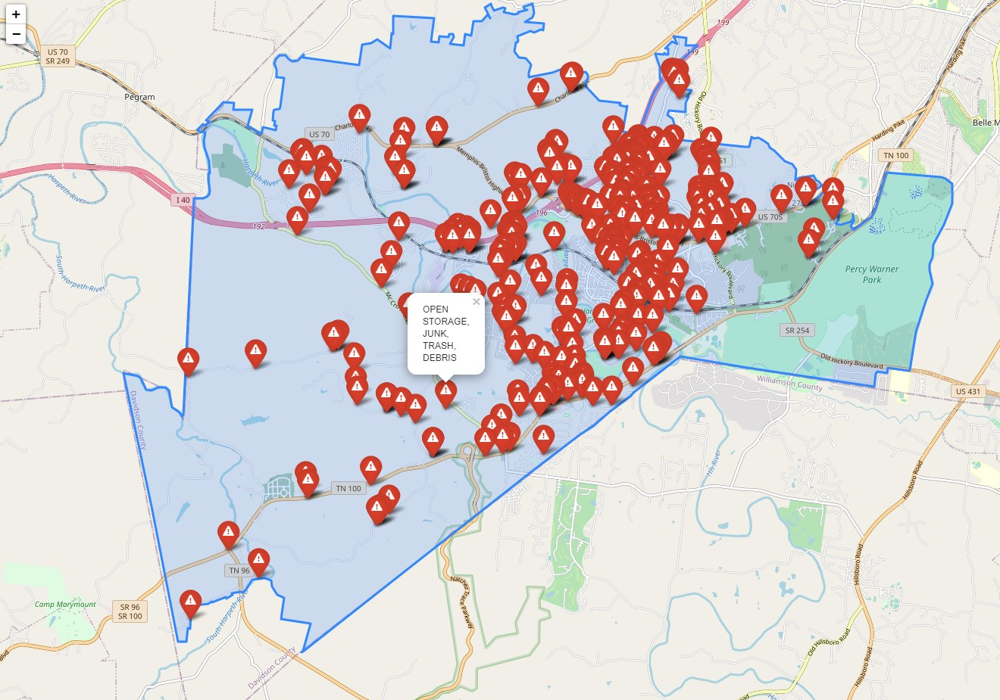
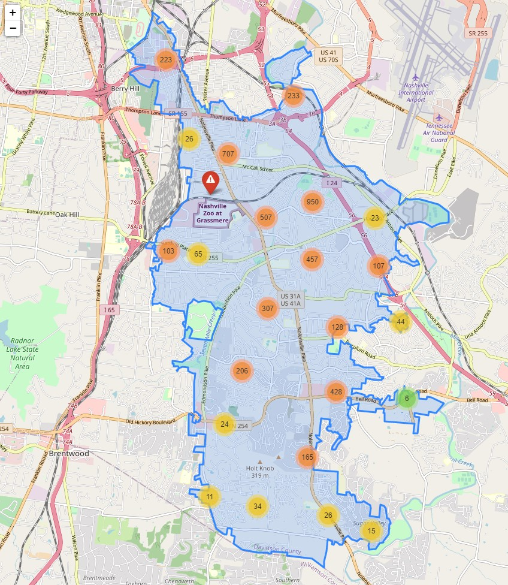

# Bellevue Property Code Violations
A look at property code violations in Nashville, focusing on Bellevue

## Table of contents
* [General info](#general-info)
* [Screenshots](#screenshots)
* [Technologies](#technologies)
* [Features](#features)
* [Status](#status)
* [Inspiration](#inspiration)

## General info
I wanted to practice geospatial coding by making a map of property code violations. Using the Nashville Open Data Portal I was able to see over 80,000 violations for Davidson County over the past 3 years. 
Since I live in the Bellevue area, I filtered it down to the 405 violations that have occured in my zip code. I wanted to see what could potentially get me in trouble in my neighborhood (SPOILER ALERT: High Weeds and Open Storage of Trash and Debris).

For further practice I looked at the Nolensville area, which had nearly 10 times the violations as Bellevue. I grouped the individual points into clusters so the large dataset could work on the map.

## Screenshots
Map of Bellevue

Cluster Map of Nolensville

## Technologies
* Jupyter Notebook - Python 3.7.6 (default, Jan  8 2020, 20:23:39) [MSC v.1916 64 bit (AMD64)]
	             IPython 7.12.0 -- An enhanced Interactive Python
* conda geospatial environment

## Features
List of features ready and TODOs for future development
* Markers show where individual violations occurred
* Click on the marker to see the specific violation 

To-do list:
* Key different marker icons to specific violations

## Status
Project is: Completed. Additional icon functionality to be added later for more practice in folium. 

## Inspiration
Mowing the grass is not only great exercise, it also keeps you in property code compliance! 
